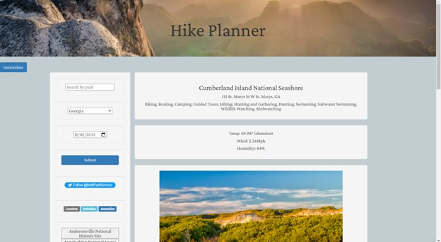

# Team-Fabulous-P1-API-Application

## Description

Application displaying usage of server-side API's that allows the user to check for National Park amenities and local weather to plan for their outdoor activities accordingly.

## Installation

N/A

## Usage

Search for a park by name or by state.
Select a date for the intended visit.
Hit submit and select an option from the results list.

## Credits

[Zach Ellis](https://github.com/zellis117)--API fetch requests, park data rendering\
[Tony Gray](https://github.com/TGray95) --API fetch requests, park data rendering\
[Mary Greenwood](https://github.com/marysgreenwood) --API fetch requests, search history\
[Lisa Walsh](https://github.com/Lwalsh2022) --Formatting, instructions module\
Ashley Owens --photo, bison grazing, Grand Teton National Park

## License

This project is licensed under the MIT license.
https://opensource.org/licenses/MIT

## Screenshots

## Deployed Application

[https://marysgreenwood.github.io/Hike-Planner/](https://marysgreenwood.github.io/Hike-Planner/)
